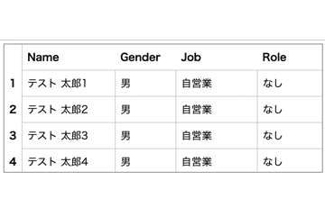

# fixed-table
Display a table with fixed columns and rows on your web site.



## DEMO
https://dmorita00.github.io/fixedTable/

## Install
- [Github](https://github.com): Clone or Download
- [CDN](https://github.com/jsdelivr/jsdelivr):
  - CSS: Insert below code in the `<head>` tag.
```html
<link rel="stylesheet" type="text/css" href="https://cdn.jsdelivr.net/gh/dmorita00/fixed-table/dist/style.css">
```
  - JS: Insert below code in the bottom of the `<body>` tag.
```html
<script src="https://cdn.jsdelivr.net/gh/dmorita00/fixed-table/dist/index.js"></script>
```

## How to use
For fixedTableInit, set the below arguments and call the method.
- div tag id name
- Header value
- Row value

```html
<div id="fixed-table" style="width: 500px; height: 200px;"></div>
<script src="https://cdn.jsdelivr.net/gh/dmorita00/fixed-table@0.0.8/dist/index.js"></script>
<script>
  if (window?.fixedTableInit) {
    window.fixedTableInit(
      "fixed-table",
      [
        'Name　　　　　',
        'Gender　',
        'Job　　　　　',
        'Role　　　　　',
        'Address　　　　　　　　　　',
        'Phone　　　　　　　　　　',
      ],
      [
        ['テスト 太郎1', '男', '自営業', 'なし', '東京都XXXXXXXXXXXX', '080-XXXX-XXXX'],
        ['テスト 太郎2', '男', '自営業', 'なし', '東京都XXXXXXXXXXXX', '080-XXXX-XXXX'],
        ['テスト 太郎3', '男', '自営業', 'なし', '東京都XXXXXXXXXXXX', '080-XXXX-XXXX'],
        ['テスト 太郎4', '男', '自営業', 'なし', '東京都XXXXXXXXXXXX', '080-XXXX-XXXX'],
        ['テスト 太郎5', '男', '自営業', 'なし', '東京都XXXXXXXXXXXX', '080-XXXX-XXXX'],
        ['テスト 太郎6', '男', '自営業', 'なし', '東京都XXXXXXXXXXXX', '080-XXXX-XXXX'],
        ['テスト 太郎7', '男', '自営業', 'なし', '東京都XXXXXXXXXXXX', '080-XXXX-XXXX'],
        ['テスト 太郎8', '男', '自営業', 'なし', '東京都XXXXXXXXXXXX', '080-XXXX-XXXX'],
      ]
    );
  }
</script>
```

That’s all.

## License
[MIT](https://opensource.org/licenses/mit-license.php)

## Author
[dmorita00](https://github.com/dmorita00)

## Keywords
fixed-cell fixed-column fixed-table typescript

## To close
Thank you for watching my repo.
